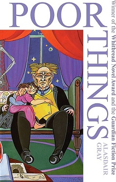
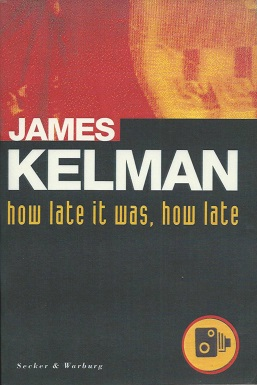

# Preface

Many attempts have been made by translators to preserve the peculiar relationship that the Scots language has with Standard English. The translation strategies most often employed, however, fail to preserve the sense of ‘Scottishness’ or else border on being ridiculous. It may be because of that particular obstacle that translations of Scottish works are not very often successful in Poland, even if their author is otherwise critically acclaimed. This is often compounded by the fact that many Polish readers, as well as translators, conflate Scottish and English writers under one, most often ‘British’ or English label. These factors lead to a loss of Scottish identity exhibited by the text — a loss many Scottish writers actively fight against.

Such is the case with James Kelman and Alasdair Gray, two Glasgow-born writers whose works are consciously written in such a way as to reflect either Glasgow (as is the case with Kelman) or Scotland as a whole (as seen in Gray’s case). Both of these writers are accomplished, prolific novelists who, through their work try to enshrine and promote different aspects of Scottish identity. Considering that both Kelman and Gray make Scotland the heart of their works, it seems obvious that their translators should strive to preserve this aspect of their works. However, that is not always entirely possible.

The two discussed works are Alasdair Gray's *Poor Things* (1992), translated into Polish by Ewa Horodyska and published in 1997 by Państwowy Instytut Wydawniczy as *Biedne Istoty*, and James Kelman's 1994 novel *How Late it Was, How Late*, translated by Jolanta Kozak and published in 2011, seventeen years after the Man Booker Prize-winning original, under the title *Jak późno było, jak późno*, also by PIW. The two highly successful Scottish novels, along with their (much less successful) Polish translations, serve as an illustration of the many issues that Scottish–Polish translators are faced with, and their ways of coping with these difficulties. 

The overall aim of this thesis is to outline what is lost in the process of translation and to show examples of what the Polish translators of the two Glaswegian novels did in order to preserve the sense of 'Scottishness', as well as Scottish identity as such, in the target text. 

Chapter 1 is devoted to an overview of the national identity of the Scottish people, the local identity of Glaswegians, as well as the characteristic features of the Glasgow patter. The identity of the Scots is in many ways based on a romanticised vision of the past. It is important for a translator of Scottish works to become acquainted with the events which constitute this past, along with many other elements of Scottish national identity. Proper care should be taken in order not to accidentally omit these elements in the translated text.

Chapter 2 outlines the issue of dialect in translation. Dialect translation is a relatively young field of study, which has previously been, for the most part, ignored by translation scholars. The most popular assumption among translators was for quite some time that language varieties were completely untranslatable. The chapter outlines the developments in the field which led to the creation of some strategies which help to cope with the issue of dialect and also briefly presents various applicable strategies — most notably the strategies described by Berezowski and Ramos Pinto.

Chapter 3 introduces the figure of James Kelman. His writing, which makes heavy use of the Glaswegian dialect serves as a political statement against the language norms deemed acceptable by the literary world and for preserving the Glaswegian identity. These issues are especially important during the analysis of How Late it Was, How Late and the translation strategies used by Kozak in order to preserve the Glasgow-centric theme of the novel. Among some of the issues raised in the chapter are working-class discourse, preserving Scots language forms in the translated text, prestige dialects, as well as language elitism and its influence on the translation.

The final chapter concerns Alasdair Gray and his literary output. While Kelman’s Scotland, or more specifically Glasgow, is clearly visible in the original text, Gray’s Glaswegian setting seems to be of less importance. That is, however, not the case. Despite its lower visibility, Caledonia remains a central part of Poor Things. However, translating this metaphorical connection, which is realized through the character of Bella Baxter, seems to be a daunting task due to its dependence on the readers’ extratextual knowledge.